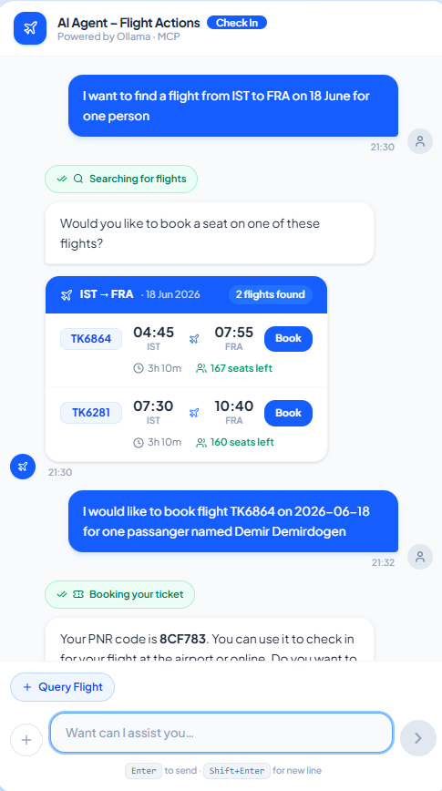
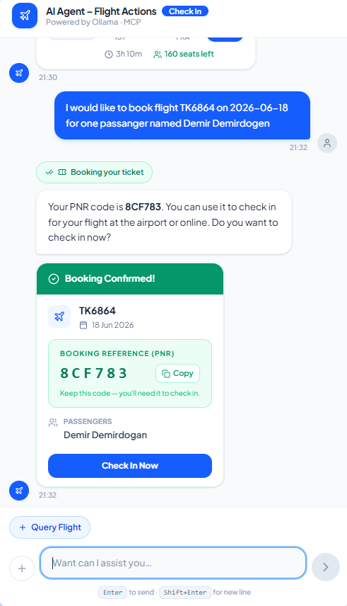
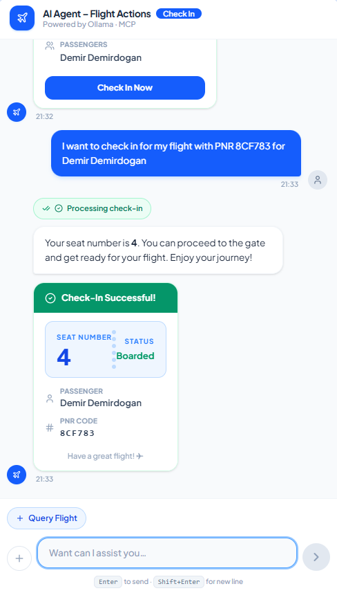
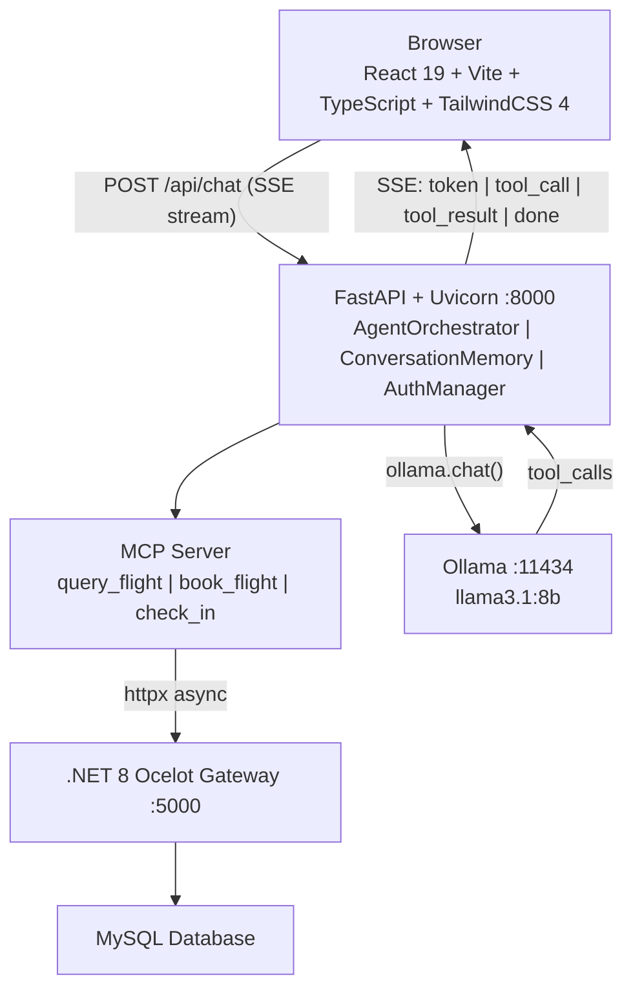
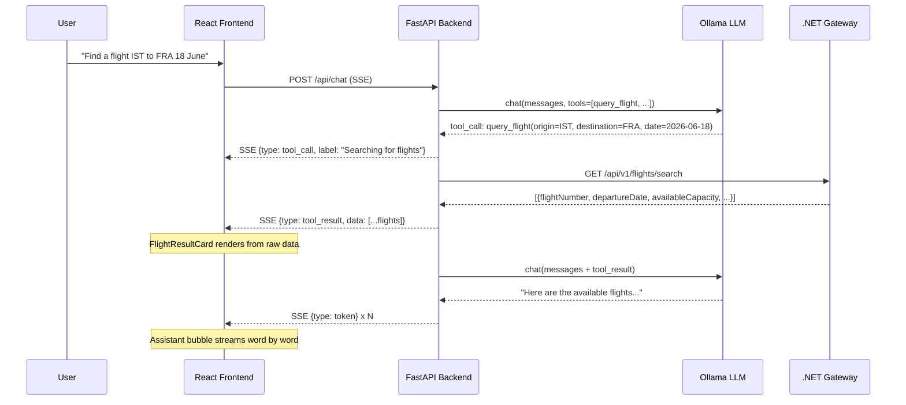
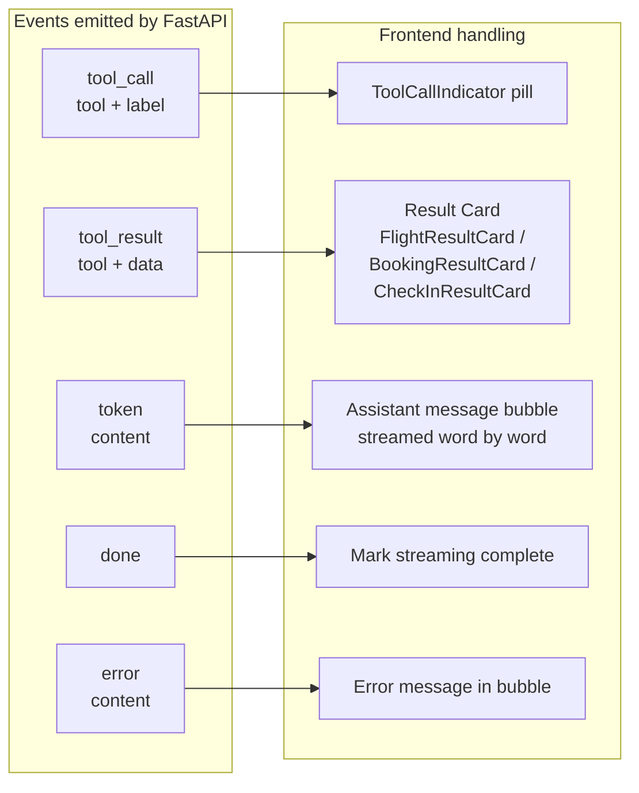
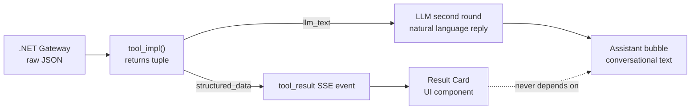

# Airline AI Agent: MCP Chat Application

A conversational AI assistant that lets users search for flights, book tickets, and check in - entirely through natural language, powered by a local LLM via Ollama and the Model Context Protocol (MCP).

---

## Links

| Resource | URL |
|---|---|
| Source Code | [github.com/this-Demir/airline-mcp-agent](https://github.com/this-Demir/airline-mcp-agent) |
| Demo Video | [Add your video link here](https://YOUR_VIDEO_LINK_HERE) |
| API Specification | [`docs/airline-api.json`](./docs/airline-api.json) |

---

## Screenshots

| Flight Search | Booking Confirmed | Check-In |
|:---:|:---:|:---:|
|  |  |  |

---

## Overview

This project builds an AI Agent layer on top of an existing .NET 8 Airline Ticketing infrastructure. Users chat in plain English; the agent translates their intent into structured API calls using MCP-style tool calling with a locally-running Ollama LLM.

The core architectural guarantee: **flight data, booking confirmations, and seat assignments are always rendered from raw API responses - never from LLM-generated text.** This eliminates hallucination for safety-critical travel information.

---

## Architecture

### System Layers



### Request Flow: Flight Search



### SSE Event Contract



---

## Tech Stack

### Frontend

| Package | Version | Role |
|---|---|---|
| React | 19 | UI framework |
| Vite | 8 | Build tool and dev server |
| TypeScript | 6 | Type safety |
| TailwindCSS | 4 | Utility-first styling |
| lucide-react | 1.8 | Icon library |
| react-markdown + remark-gfm | 10 / 4 | Renders LLM markdown output |

### Backend

| Package | Version | Role |
|---|---|---|
| FastAPI | >= 0.104 | HTTP and SSE server |
| Uvicorn | >= 0.24 | ASGI runner |
| Ollama Python SDK | >= 0.3 | LLM client |
| httpx | >= 0.25 | Async HTTP to .NET Gateway |
| sse-starlette | >= 1.8 | Server-Sent Events |
| pydantic | >= 2.5 | Request and response validation |
| python-dotenv | >= 1.0 | Environment config |

### Infrastructure (pre-existing, not built in this project)

- **.NET 8 Ocelot API Gateway** - `http://35.170.75.61:5000`
- **MySQL** - Populated with flight and passenger data
- **Ollama** - Running locally on `http://localhost:11434`

---

## Project Structure

```
airline-mcp/
├── frontend/
│   └── src/
│       ├── components/
│       │   ├── ChatWindow.tsx          # Welcome screen and message list
│       │   ├── MessageBubble.tsx       # User and assistant bubbles
│       │   ├── ChatInput.tsx           # Input field with suggestion chips
│       │   ├── ToolCallIndicator.tsx   # "Searching for flights" status pill
│       │   ├── FlightResultCard.tsx    # Flight search results UI
│       │   ├── BookingResultCard.tsx   # Booking confirmation UI
│       │   └── CheckInResultCard.tsx   # Check-in result UI
│       ├── hooks/
│       │   └── useChat.ts              # SSE stream consumer and message state
│       ├── services/
│       │   └── api.ts                  # fetch() SSE wrapper
│       └── types/
│           └── chat.ts                 # TypeScript interfaces
│
├── backend/
│   ├── agent/
│   │   ├── orchestrator.py             # Agentic loop: multi-round LLM and tools
│   │   ├── memory.py                   # Per-session conversation history
│   │   └── prompt.py                   # System prompt with anti-hallucination rules
│   ├── mcp_server/
│   │   ├── tools.py                    # query_flight / book_flight / check_in
│   │   ├── api_client.py               # Async .NET Gateway HTTP client
│   │   └── iata_codes.py               # City name to IATA code lookup
│   ├── models/
│   │   └── schemas.py
│   ├── auth_manager.py                 # JWT login and auto-refresh
│   ├── config.py                       # Settings from .env
│   ├── main.py                         # FastAPI app and lifespan
│   └── requirements.txt
│
├── docs/
│   └── airline-api.json                # .NET OpenAPI spec - source of truth
└── README.md
```

---

## Getting Started

### Prerequisites

- Python 3.11 or later
- Node.js 20 or later
- Ollama installed and running (`ollama serve`)
- The .NET 8 Gateway reachable at the configured URL

Pull the LLM model before first run:

```bash
ollama pull llama3.1:8b
```

### 1. Clone

```bash
git clone https://github.com/this-Demir/airline-mcp-agent.git
cd airline-mcp-agent
```

### 2. Backend

```bash
cd backend
python -m venv .venv
source .venv/Scripts/activate      # Windows
# source .venv/bin/activate         # macOS / Linux

pip install -r requirements.txt
cp .env.example .env               # then fill in the values
```

```env
AIRLINE_USER_EMAIL=your@email.com
AIRLINE_USER_PASSWORD=yourpassword
OLLAMA_MODEL=llama3.1:8b
GATEWAY_URL=http://35.170.75.61:5000
OLLAMA_BASE_URL=http://localhost:11434
```

```bash
uvicorn main:app --reload --port 8000
```


### 3. Frontend

```bash
cd frontend
npm install
npm run dev      # http://localhost:5173
```

---

## MCP Tools Reference

| Tool | Endpoint | Auth | Required Parameters |
|---|---|---|---|
| `query_flight` | `GET /api/v1/flights/search` | None | `origin`, `destination`, `departure_date` |
| `book_flight` | `POST /api/v1/tickets/purchase` | Bearer JWT | `flight_number`, `flight_date`, `passenger_names[]` |
| `check_in` | `POST /api/v1/checkin` | None | `pnr_code` (6-char), `passenger_name` |

IATA codes are automatically resolved - users can type "Istanbul" and the agent maps it to `IST`.

---

## API Endpoints

```
GET  /api/health
     Response: {"status": "ok", "authenticated": bool, "model": str}

POST /api/chat
     Body:     {"message": str, "session_id": str}
     Response: EventSourceResponse (SSE)

SSE event types:
     {"type": "tool_call",   "tool": str, "label": str}
     {"type": "tool_result", "tool": str, "data": object | array}
     {"type": "token",       "content": str}
     {"type": "done"}
     {"type": "error",       "content": str}
```

---

## Design Decisions

### Structured tool_result SSE events - anti-hallucination architecture

The highest risk in an LLM-powered booking app is displaying fabricated data to the user. The solution implemented here decouples result rendering entirely from the LLM's text output.

Each tool implementation (`query_flight_impl`, `book_flight_impl`, `check_in_impl`) returns a `(llm_text, structured_dict)` tuple. The orchestrator immediately emits a `tool_result` SSE event containing the raw structured data before the LLM writes its text response. The frontend renders the flight, booking, or check-in card from this event - guaranteed to reflect the actual API response regardless of what the LLM says.



### Multi-round agentic loop

The orchestrator runs up to five decision rounds per user message. Each round sends the full conversation history plus tool definitions to Ollama. If the model requests a tool call, the orchestrator executes it, appends the result, and loops. When the model produces text with no tool call, it is streamed and the loop exits. This design allows compound queries such as "find a flight and book the cheaper one" without additional user prompts.

### Dual tool-call format support

Ollama models differ in how they encode tool calls. `llama3.1:8b` uses the native `message.tool_calls` field. Older or smaller models embed a JSON object in `message.content`. The `_extract_tool_calls()` function in `orchestrator.py` detects and normalises both formats, keeping the system compatible across model versions.

### Pre-fill rather than auto-send

Quick-action buttons on the welcome screen and contextual suggestion chips pre-fill the input textarea instead of sending immediately. The user can review and edit before confirming. This is deliberate - in a financial transaction context, preventing an accidental booking from a single misclick is more important than saving one Enter key press.

### JWT managed transparently at startup

The backend posts the credentials from `.env` to `/api/v1/auth/login` during FastAPI lifespan startup, caches the JWT in memory, and automatically retries with a refreshed token on a `401` response. The frontend has no login screen and no awareness of authentication - it is handled entirely by `AuthManager`.

### Per-session conversation memory

Each browser tab generates a UUID `session_id` on page load. The backend `ConversationMemory` class stores the full message history keyed by `session_id`, allowing the LLM to reference earlier context within a session (for example, "book the second one" after a search). Memory is in-process and does not persist across server restarts, which is appropriate for a local demo deployment.

---

## Assumptions

1. The .NET 8 Ocelot Gateway and MySQL database are already deployed and populated with flight data. This project builds only the AI layer on top of the existing infrastructure.

2. A single set of user credentials is stored in `.env`. The JWT is shared across all frontend sessions. Multi-user authentication was explicitly out of scope.

3. Ollama is installed and running on the developer's machine. Response latency of 30 to 60 seconds on CPU is acceptable for a local demo.

4. The system prompt injects `date.today()` so the LLM can resolve relative dates such as "tomorrow" or "next Friday" correctly.

5. The IATA lookup table covers approximately 40 major airports. For airports not in the table, the user must provide the IATA code directly.

6. One Ollama model is active at a time, selected via the `OLLAMA_MODEL` environment variable. Switching models requires a server restart.

---

## Issues Encountered

### LLM hallucinating flight results

**Problem:** The LLM invented flight numbers and departure times that were never returned by the tool, presenting them as real options to the user.

**Root cause:** The system prompt did not strongly enough prohibit fabrication, and the LLM filled gaps with patterns from its training data.

**Solution:** Added an "ABSOLUTE RULES" section to the system prompt. More critically, result cards now render exclusively from the `tool_result` SSE event - the LLM text is purely conversational and cannot affect what flight data appears in the UI.

---

### LLM omitting flight data from its text response

**Problem:** After `query_flight` returned results, the LLM replied "Would you like to book one of these flights?" without listing them. Users had no way to see the flights.

**Root cause:** The LLM inferred that the user could see the raw tool output, as in some agentic frameworks. In this SSE streaming design, only the LLM's text reply appears in the assistant bubble.

**Solution:** Added the following sentence to the system prompt: *"The user cannot see the raw tool output - your text reply is the ONLY way they see the results."* Combined with an explicit formatting rule requiring all flights to be listed before any follow-up question.

---

### Dual tool-call formats across Ollama models

**Problem:** Testing across different Ollama model versions caused tool calls to be silently ignored because the orchestrator only handled one encoding format.

**Solution:** Extracted `_extract_tool_calls()` to detect both the native `tool_calls` field (Format A) and JSON embedded in `content` (Format B), with Format A taking priority.

---

### Date format mismatch between LLM output and the purchase endpoint

**Problem:** The LLM correctly produces `yyyy-MM-dd` for search queries, but the `/api/v1/tickets/purchase` endpoint requires `yyyy-MM-ddT00:00:00`.

**Solution:** Added `normalize_flight_date()` in `tools.py` which appends `T00:00:00` when no time component is present.

---

### passenger_names serialized as a JSON string

**Problem:** Certain Ollama models serialized the `passenger_names` array as the string `'["John Doe"]'` rather than an actual JSON array, causing the booking payload to be malformed.

**Solution:** `book_flight_impl()` checks for string input and attempts `json.loads()` before falling back to treating the value as a single passenger name.

---

### IATA resolution bypassed by the LLM

**Problem:** Despite system prompt instructions, the LLM occasionally passed city names such as "Istanbul" instead of the expected IATA code "IST", causing the API to return no results.

**Solution:** `resolve_iata()` in `mcp_server/iata_codes.py` performs a case-insensitive lookup as a final normalisation step inside the tool itself, independent of whether the LLM followed instructions.

---

## Environment Variables

| Variable | Default | Description |
|---|---|---|
| `AIRLINE_USER_EMAIL` | - | Login credentials for JWT acquisition |
| `AIRLINE_USER_PASSWORD` | - | Login credentials for JWT acquisition |
| `OLLAMA_MODEL` | `llama3.1:8b` | Ollama model name |
| `GATEWAY_URL` | `http://35.170.75.61:5000` | .NET Gateway base URL |
| `OLLAMA_BASE_URL` | `http://localhost:11434` | Ollama server URL |

---

Built with FastAPI, React, Ollama, and MCP.
